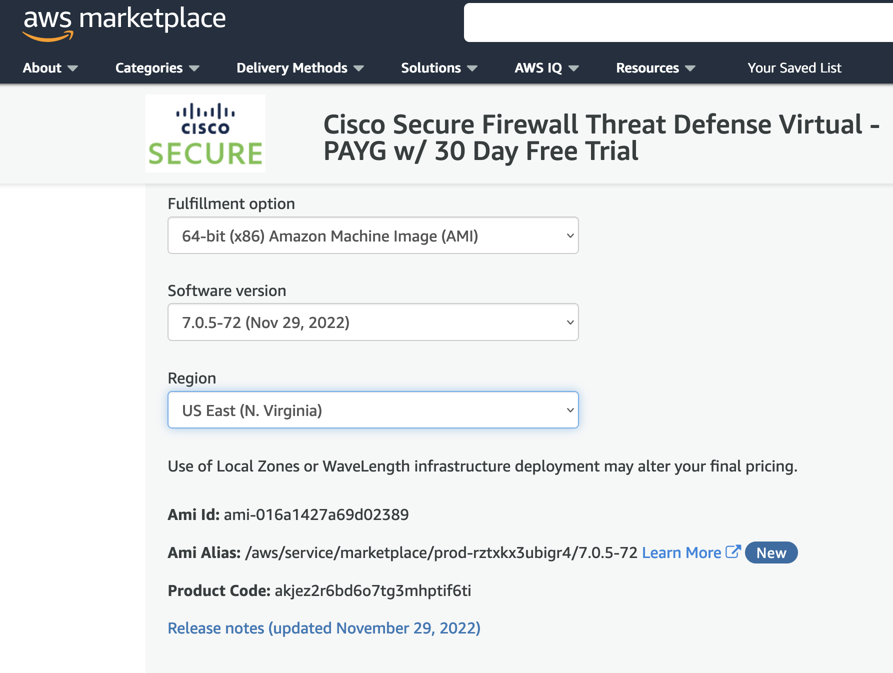

# Cisco Firepower Threat Defense Deployment in AWS

Terraform module to deploy a given number of FTDv appliances in AWS in a single Availability Zone

> NOTE: This is a fork that's been updated from GH@ [amansin0504](https://github.com/amansin0504/aws-singleazftd-terraform) to run in Docker and create all the resources necessary.

## Finding AMI

To get the correct AMI for the Region/AZ of your choosing, you'll need to access the AWS Console and subscribe to one of the available options for [Cisco FTDv](https://aws.amazon.com/marketplace/search/results?searchTerms=Cisco+FTDv).

Upon subscription, you will be prompted to select the Region and the `ami` will be displayed for you. 

If you select a different `Region` the `Ami id` value will auto-update. Grab this value and update the `variables.tf` file for your desired `Region`.

## Disclaimer

This terraform module is not an officially supported Cisco product. For official Cisco NGFWv documentation visit the [page](https://www.cisco.com/c/en/us/td/docs/security/firepower/quick_start/aws/ftdv-aws-gsg.html).
